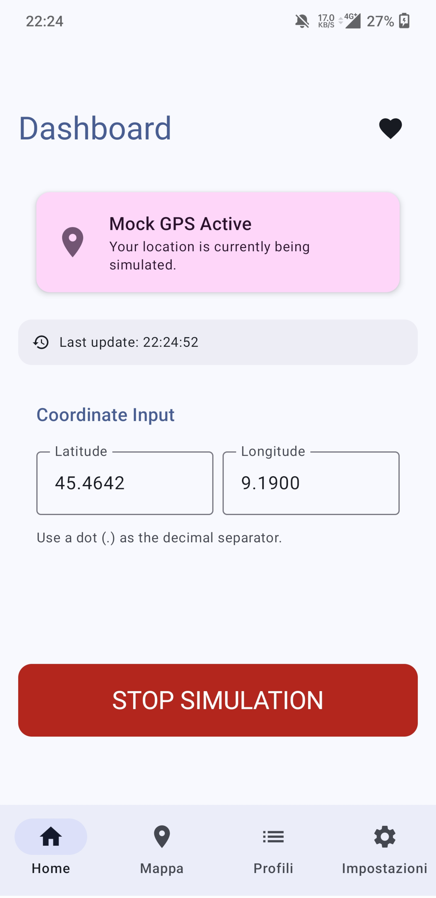
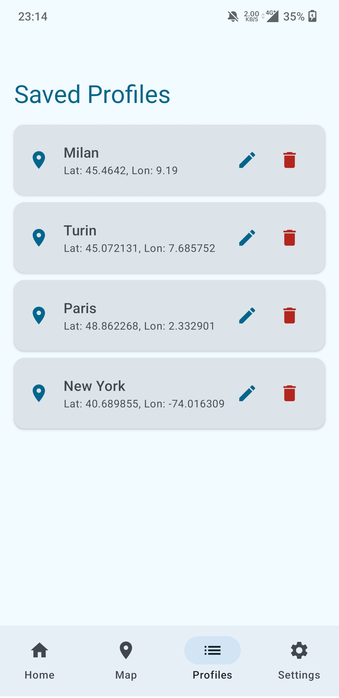
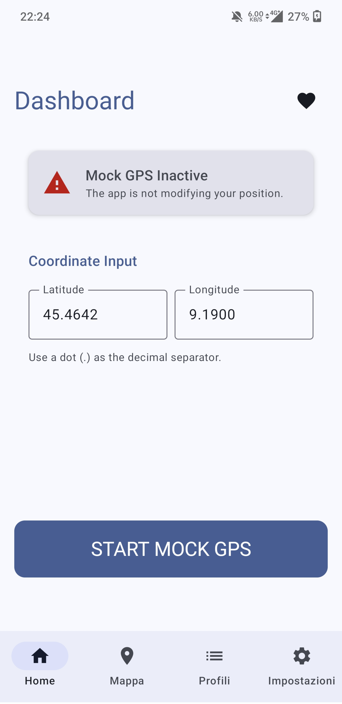
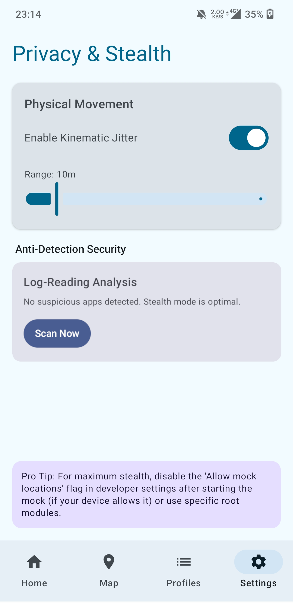
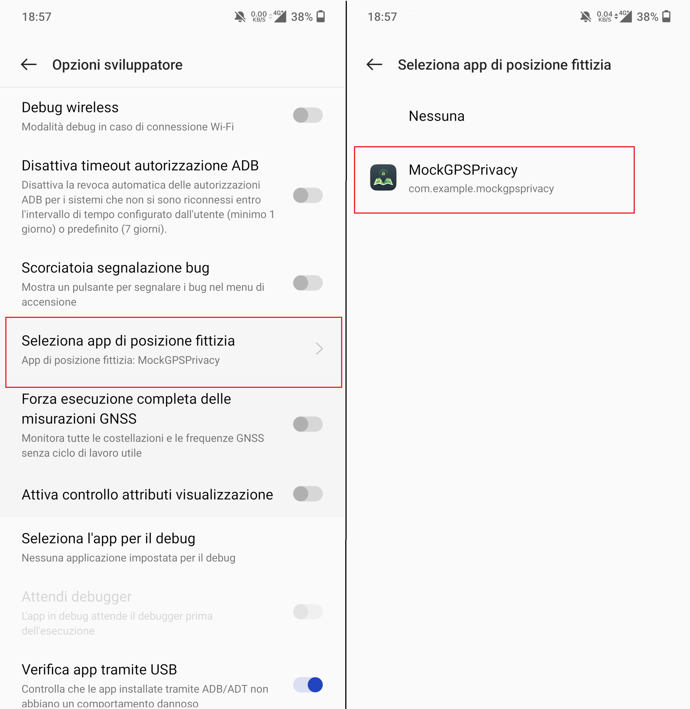
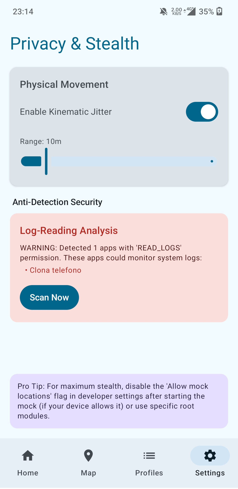

# MockGPSPrivacy

**MockGPSPrivacy** is an advanced Android application for GPS location simulation, designed with a strong focus on user privacy and security (Stealth Mode).

## 🚀 Main Features

- **Precise GPS Simulation**: Set your location anywhere in the world.
  

- **Stealth Mode (Privacy Check)**: Scans the system for suspicious applications that might read system logs or detect the use of mock locations.
- **Dynamic Jitter**: Adds a controlled random variation (in meters) to the simulated position to make it more natural and less detectable by tracking systems.
- **Profile Management**: Save and manage different favorite locations for quick switching.
  

- **Background Service**: Keeps the simulated location active even when the app is closed, thanks to a foreground service with a persistent notification.
- **Modern Interface**: Developed entirely with Jetpack Compose and Material 3.
  

## 🧠 Technical Details: Jitter & Kinematic Physics

Unlike common mock GPS apps that apply static random noise to coordinates, MockGPSPrivacy uses a **Kinematic Engine** to simulate realistic movement:

- **Elastic Force (Hooke's Law)**: A virtual restorative force (`F = -k*x`) keeps the simulated position within the set range.
- **Inertia and Acceleration**: The simulated point has a virtual "mass" and variations occur through random accelerations (Random Walk), avoiding detectable abrupt jumps.
- **Damping**: A friction coefficient ensures the movement is fluid and simulates the natural drift of a real GPS signal.
- **Geographic Coherence**: The calculated offset in meters is converted into geographic coordinates taking into account the Earth's curvature.

## 📥 Download

> **[⬇️ Download latest APK](https://github.com/emanuele8888/MockGPSPrivacy/releases/latest)**

No need to build from source — download the pre-built APK directly from the **Releases** page and sideload it on your device (enable *Install from unknown sources* in your settings).

## 🛠️ Requirements and Installation

1. **Developer Options**: Enable "Developer options" on your Android device.
2. **Select Mock Location App**: In developer options, search for "Select mock location app" and choose **MockGPSPrivacy**.

3. **Permissions**:
    - **Location**: Necessary for GPS functionality.
    - **QUERY_ALL_PACKAGES**: This permission is fundamental for **Stealth Mode**. It allows the app to scan installed packages to identify monitoring tools or potential privacy threats. *Note: While this permission is considered "sensitive" by Google Play policies, it is essential for the security and transparency purposes of this open-source project.*

## 🛡️ Privacy and Security

Unlike many other mock GPS apps, MockGPSPrivacy includes tools to identify third-party apps attempting to monitor GPS behavior. "Stealth Mode" helps the user understand if the execution environment is secure.

## 🛠 Tech Stack

- **Language**: Kotlin
- **UI**: Jetpack Compose
- **Architecture**: MVVM (Model-View-ViewModel)
- **Dependency Injection**: Manual (configurable for Hilt)
- **Local Database**: SharedPreferences (via PreferencesManager)

## ✍️ Author

Developed by **Emanuele Miggliazzo** (2026).

---

*Note: This application is intended for testing and development purposes. Misuse to violate the terms of service of other applications is the user's responsibility.*
